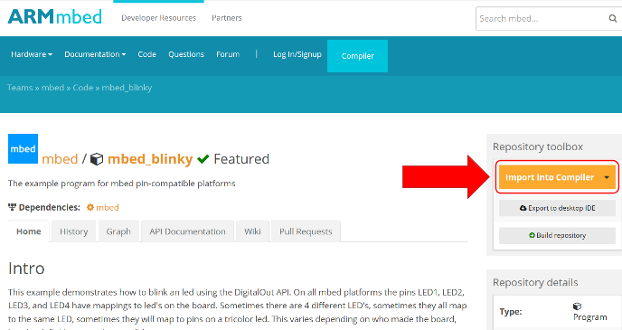
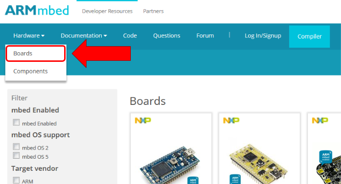
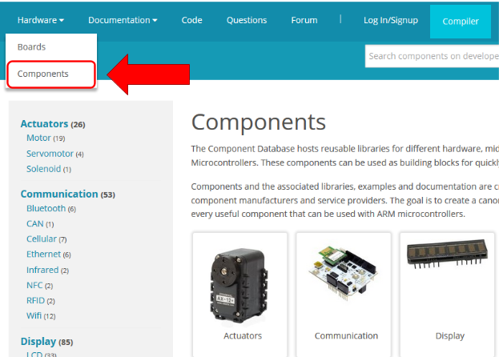
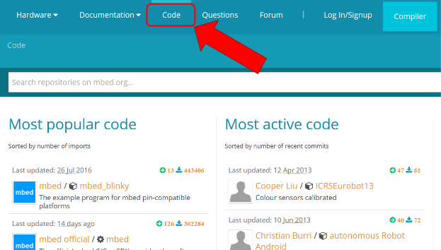
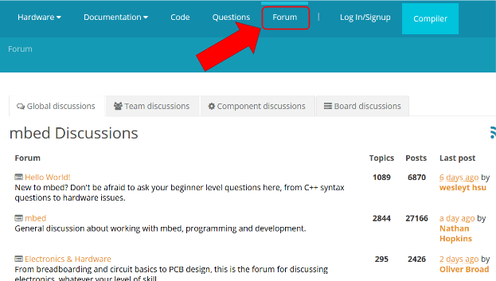

# mbed ecosystem overview

The mbed ecosystem covers a wide range of tools, services, example code and documentation, which help you develop hardware and software for ARM microcontrollers. The mbed Hardware Development Kit (HDK), mbed Software Development Kit (SDK) and various tools and services make up the core of the mbed ecosystem. 

## The Hardware Development Kit
The [mbed HDK](https://docs.mbed.com/docs/mbed-hardware-development-kit/en/latest/) is a collection of resources to assist in the design and development of custom hardware. The designs in the HDK provide an entry point and purposeful tradeoffs between hardware and software optimizations. 

The tradeoffs made in the HDK echo through the SDK and the boards in the mbed ecosystem, so if you are considering making a board using the HDK, please use the exact design. Changing anything in the HDK design will have an effect further up the stack in the SDK. 

The full HDK can be found on GitHub: [https://github.com/armmbed/mbed-hdk](https://github.com/armmbed/mbed-hdk). 

### DAPLink
The reference layout files for [DAPLink](https://github.com/mbedmicro/DAPLink) can be found in the mbed HDK. DAPLink provides our solution for programming and debugging mbed-enabled microcontrollers. DAPLink allows mbed boards plugged into a computer to appear as a mass storage device, so you can drag and drop compiled binaries to the board. 

### Other layout files
The HDK also contains a myriad of mbed reference designs. In the future, the mbed HDK is going to be the place to find the layout files for all reference designs, projects, and so on. 

## The Software Development Kit
The mbed Software Development Kit (SDK) contains all of the software that makes up the core of the mbed ecosystem. At the heart of the SDK is mbed OS, along with various peripheral, networking interface and connectivity APIs. The biggest thing to note is that all APIs are now thread safe. 

For traditional microcontroller API examples [see here](https://docs.mbed.com/docs/mbed-os-api-reference/). 
 
For mbed OS extended examples [see here](https://developer.mbed.org/teams/mbed-os-examples/).

### mbed OS API
mbed OS is at the core of the mbed SDK; all other APIs either use mbed OS directly or are compatible with it. 

The core of mbed OS is based on the Keil RTX v5 RTOS. mbed OS provides RTOS-like functionality to all other APIs in the SDK, meaning mbed OS can perform task management, which allows your software to utilize the processor efficiently, switching between tasks as needed. Threads are the primary enabler of task management. 

The mbed OS API reference [can be found here](https://docs.mbed.com/docs/mbed-os-api-reference).

### Peripheral APIs
The mbed OS peripheral APIs cover functionality like SPI, UART, I2C and PWM. These ‘classic’ APIs do not require the RTOS component of mbed OS to operate, though they are part of mbed OS. All the peripheral APIs are thread safe. 

The complete list of peripheral APIs [can be found here](https://docs.mbed.com/docs/mbed-os-api-reference/en/5.1/APIs/io/inputs_outputs/).

### NSAPI
The [Network Socket API (NSAPI)](https://docs.mbed.com/docs/mbed-os-api-reference/en/5.1/APIs/communication/network_sockets/) is the base connectivity API that provides an identical socket-like interface across all IP connectivity protocols. By using the NSAPI you can use the exact same application code for Ethernet, WiFi, Cellular and so on. This means you can create your code using Ethernet, for example, and then easily switch to WiFi by adding the WiFi library and changing the NSAPI connect call - you are not heavily invested in any one technology, so you’re free to try them all.

The connect function is the only function that changes by technology. This is because Ethernet doesn't need any connectivity options, so it’s a simple call: `eth.connect()`, whereas WiFi requires an SSID and password, so it looks like this: `wifi.connect(ssid,pw)`. 

### Other APIs
APIs like Bluetooth Low Energy (BLE) have already been pulled into the mainline SDK. In the future, APIs like LoRA, Thread and NFC may also be mainlined. Until then, they are separate libraries that you can pull in as needed. 

## mbed CLI
The mbed command line interface (CLI) is the primary tool used to build mbed OS 5 projects. 

mbed CLI is a Python command line utility that runs on Windows, Mac OS X and Linux. Whether you want to build a project locally (`mbed compile`), run tests associated with a project (`mbed test`), or export a project to different IDEs (`mbed export`), mbed CLI has you covered. In addition to traditional code management, mbed CLI also works with git and Mercurial back ends, so if you want to use your code on mbed or on GitHub, everything works.

The mbed team uses mbed CLI as the internal back end utility. We have open-sourced it for public use in an effort to make the online <-> offline transition easier. If you would like to install mbed CLI we’ve made an How To video: 

For more information on using mbed CLI see the Handbook pages for [Blinky on mbed CLI]( https://docs.mbed.com/docs/mbed-os-handbook/en/5.1/getting_started/blinky_cli/) or the [full mbed CLI guide](https://docs.mbed.com/docs/mbed-os-handbook/en/5.1/dev_tools/cli/).

### Going offline

To take your code from the online environment to your local computer, you can use either mbed CLI or the mbed Online Compiler:

* In mbed CLI: use the command  `mbed import http://www.link.to/your/code`.

	Once you have your code on your computer you can use mbed CLI's command `mbed export` to generate project files for your code for different IDEs. 

* In the mbed Online Compiler: right click on your project and select ‘Export to IDE’. 

We recommend using mbed CLI, because it preserves your commit history, unlike the online compiler which only exports a specific revision of your code. 

For more details, see this video: 

## Online resources
mbed has a large number of resources hosted online for your convenience. From the Online Compiler and developer community on developer.mbed.org, through the large number of docs on docs.mbed.com, to the forums for community support, there is something for anything you need to develop embedded systems. 

### Documentation
The documentation section of the website is the index for all docs hosted on [http://docs.mbed.com](http://docs.mbed.com). Any user can create docs for their project and publish them. The Documentation section contains all of the docs for the official mbed APIs and relevant example code. 

### The mbed Online Compiler
The mbed Online Compiler hosted at [developer.mbed.org/compiler](https://developer.mbed.org/) allows you to compile and edit your projects. You can also publish your code, which makes it available to others by adding an ‘Import’ button to your project’s page. 

The compiler does not include a debugger, so a common use case is to start your project in the compiler and then export to an offline compiler like Keil or IAR for debugging. 

Here is a video on getting started with the mbed Online Compiler: 

### The Boards page
The [Boards page](http://developer.mbed.org/platforms) contains a list of every board officially supported in the mbed ecosystem. 

There are links on each board’s page to add the board to your compiler, buy the board, view pinout diagrams, and install firmware updates and bug fixes. 

If you want to compile code for a board you should go to its board page and click the **Add to Compiler** button. That’s it! Now when you are in the compiler you can compile code for the board you selected. Make sure you are logged in to do this.

**Tip:** It is important that you look at the board page to learn the pin names and check for firmware updates.

### Components page
[The components page](https://developer.mbed.org/components/) is a list of software libraries and reference docs for hardware peripherals and sensors. Its goal is to speed up development by sharing code, so you don't have to waste time rewriting a driver that someone else has already created. Each component has a library and code example associated with it; you can use the import functionality described above to add code and libraries for these components to your compiler. Combined with documentation, this makes it easy to begin using a part you are not familiar with. 

### Code examples
You can find code examples for existing components in the relevant component's page or by using the search function. 

For traditional microcontroller API examples [see here](https://docs.mbed.com/docs/mbed-os-api-reference/). 

For mbed OS extended examples [see here](https://developer.mbed.org/teams/mbed-os-examples/).

### Forum
The [forum](https://forums.mbed.com/) is an excellent place to ask questions about anything and get a quick response from the community. It is mostly moderated by community members and is a source for tips, tricks and advice for all things mbed. 

