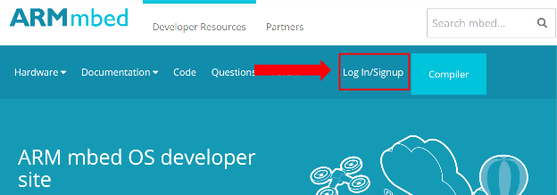
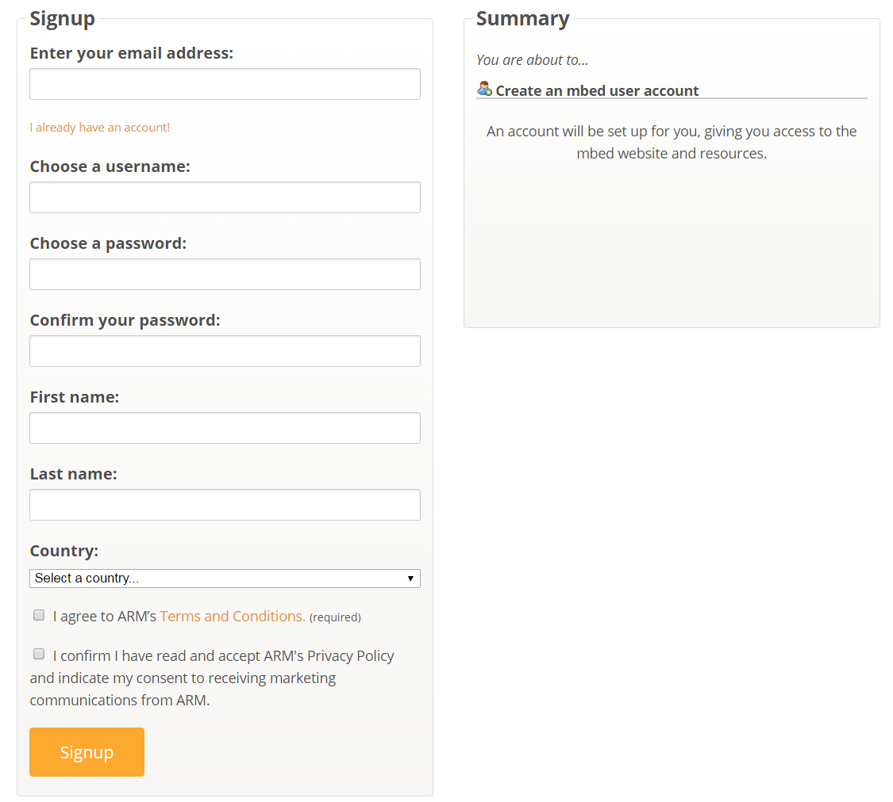

# First applications with mbed OS

We're going to use our standard LED blinking example - Blinky - to review a few ways of timing and triggering actions on mbed OS application.

## Setting up an account and choosing a tool

To work with the mbed Online Compiler or mbed CLI, you need an mbed account:

1. Go to [https://developer.mbed.org/account/login/](https://developer.mbed.org/account/login/ ) and sign up for an account. Alternatively, you can open the `mbed.html` file that is on every mbed development board. 
    
1. Fill in your information. The username you choose here will be what the community sees on your code and all comments you make.
    

Choose a tool to work with. Full instructions for building Blinky with our tools:

* [mbed CLI](https://docs.mbed.com/docs/mbed-os-handbook/en/5.1/getting_started/blinky_cli/)
* [The mbed Online Compiler](https://docs.mbed.com/docs/mbed-os-handbook/en/5.1/getting_started/blinky_compiler/)

Once you're comfortable with the tool you've selected, try the examples below.

## Example 1 - Automated Blinky
There are multiple ways to automatically blink an LED. Let's explore the three main ones:

1. [Busy wait](#busy-wait)
1. [Ticker](#ticker)
1. [Threads](#thread) 

### Busy wait
Busy wait is a method that blocks the processor for a period of time. This is an effective way to create time delays, but it’s rather inefficient because it wastes processor time and keeps the processor running at full power for the duration of the wait:

Notice `printf()`; you can enable this by uncommenting the line (remove the ‘//’). `printf()` prints to the terminal, so you can use them to get debug information. We recommend using [CoolTerm](http://freeware.the-meiers.org/), as it works the same on Windows, Linux and OS X. [Here is a handy video on how to use CoolTerm](https://www.youtube.com/watch?v=jAMTXK9HjfU) to connect to your board and view the `printf()` statements. 

### Ticker 
Tickers and timers are another way of creating a time interval. These methods are somewhat better than busy wait, because they allow other code to run while you are waiting. It is even possible, though non-trivial, to sleep during the wait period.

Here is an example that doesn't include sleeping:

### Thread 
Threads are the most efficient way to blink an LED. During the waiting period it is possible to take advantage of mbed OS optimizations to automatically conserve power and deal with other tasks. While this is not the most visually appealing method, nor the simplest, it is the preferred way for large scale deployments:

### Automated Blinky challenge
Now that you have gotten the LED to blink, try using a different LED. LED1-4 should be valid options on all boards. Some boards will have tricolor LEDs, so if you turn on multiple LEDs at once you can get different colors. Try turning on and off the various LEDs. Try creating a cool pattern. Try making the blink pattern random. 

## Example 2 - Button Blinky
Let’s try using a DigitalIn pin from the button to control the application. There are two ways to read input data: we can either constantly poll the button in a busy wait, or set an interrupt to trigger when pressed. We’ll explore these methods below. 

### Busy wait button
We can wait for digital input the same way we waited for time to pass - using a `while()` loop. In the example below the digital input is a button press, which causes the application to flash the LED and then wait for 1 second. 

**Tip:** You may need to change the `SW1` pin, as the button on your board may be called something else. Please refer to the pinmap on the [Boards page](https://developer.mbed.org/platforms/). 

We constantly poll the button to see if it has a value that matches ‘button_press’. If it matches, we toggle the LED and wait 1 second. 

`button_press` is used to denote what value the switch uses to represent the state *pushed*. Most switches are by default open (unpressed), so they will read as 0 while pressed. If you see your LED blinking without the button being pressed - try changing `button_press` to `1`.

### Interrupt button
An alternative way to poll the button is to use an interrupt. Interrupts let you say ‘when that pin changes value, call this function’. In other words, we can tell the MCU to call a function when the button is pressed. In our case, that function toggles the LED: 

In the code above we have a heartbeat function that runs on LED2, which lets you see that your code is running. Then we connect an InterruptIn object to the button and set it so that when the button rises from 0 to 1 the toggle function is called; the function toggles LED1. This way we can turn the LED on and off as needed, without needing to “waste” our time waiting or actively polling an inactive button. We (or rather - the MCU) are free to move on to other things . 

Interrupt driven programming is one of the fundamental paradigms of microcontroller programming. 

### Button challenge
Now that you understand how to blink an LED and read button presses, try creating a game where you have to press the button when the LED is on. A successfully timed press lights up the next LED on the board (again, LED1-4 should be valid options). Think of the LEDs as levels, and to advance you have to pass the previous level. 

